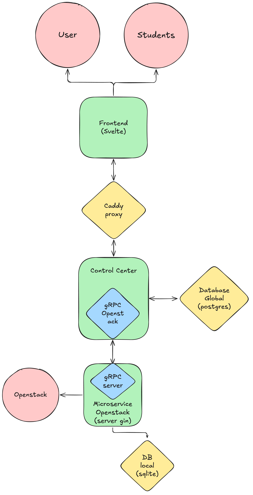

# Control Center

## Rôle général

Le Control Center est le point d’entrée principal du backend.
Il reçoit toutes les requêtes provenant du frontend et orchestre les différentes actions nécessaires au bon fonctionnement du système.

Il agit comme un chef d’orchestre entre :

- le frontend
- la base de données
- les services de gestion des machines virtuelles (VM)

## Explication du Workflow

<!-- markdownlint-disable MD033 -->

<!-- markdownlint-enable MD033 -->

1. Le frontend envoie une requête.
2. Le Control Center analyse et valide la demande.
3. Il déclenche les actions nécessaires :
    - communication avec d'autres microservices
    - mise à jour de la base de données
    - planification de ressources
4. Il renvoie les mises à jour au frontend en temps réel.

Le fichier proto permettant la communication entre control center et le microservice openstack est [poolmanager.proto](../proto/poolmanager.proto)
Le fichier proto permettant la communication entre control center et le front est [frontcontrol.proto](../proto/frontcontrol.proto)
