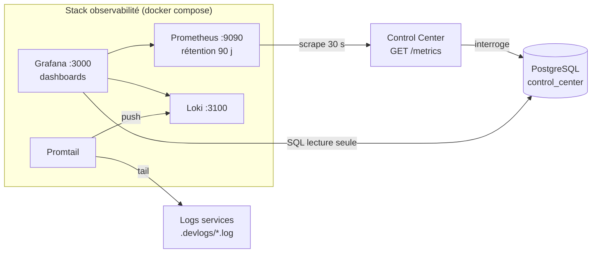
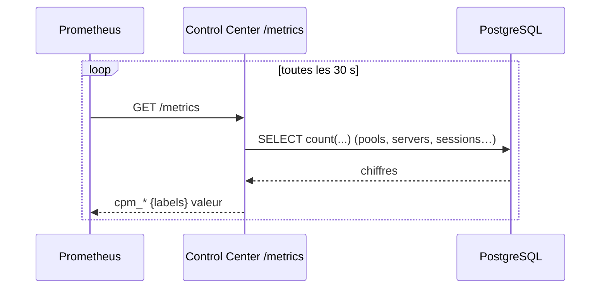
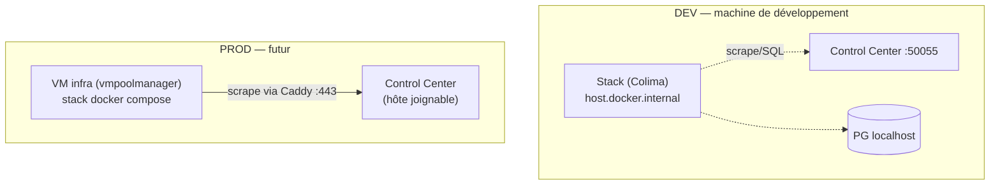

# Observabilité — métriques, logs, usage

Stack de supervision pour suivre l'**usage** de la plateforme (heures de pointe, nombre de VMs
actives, connexions, occupation des pools) et **centraliser les logs** des services. Trois
briques open-source :

| Brique | Rôle | Port |
|--------|------|------|
| **Prometheus** | Collecte et historise les **métriques** (séries temporelles) | 9090 |
| **Loki** | Stocke et indexe les **logs** | 3100 |
| **Grafana** | **Visualisation** (dashboards) + requêtes ad-hoc PostgreSQL | 3000 |
| **Promtail** | Agent qui **pousse les logs** des services vers Loki | — |

Tout est défini dans `monitoring/` (déploiement : `monitoring/README.md`).

## Vue d'ensemble



## 1. Les métriques exposées par le Control Center

Le Control Center expose un endpoint **`GET /metrics`** (port `50055`, format Prometheus). Un
*collector* custom (`control_center/grpc/metrics.go`) interroge PostgreSQL **à chaque scrape**
et publie :

| Métrique | Type | Signification |
|----------|------|---------------|
| `cpm_pools_total` | gauge | Nombre de serverpools |
| `cpm_servers{status}` | gauge | VMs par statut (`ACTIVE`, `SHUTOFF`, `BUILD`…) |
| `cpm_vms_active` | gauge | VMs avec un étudiant connecté |
| `cpm_students_total` | gauge | Étudiants enregistrés |
| `cpm_github_sessions_24h` | gauge | Connexions GitHub sur 24 h glissantes |
| `cpm_pool_students{pool,owner}` | gauge | Étudiants par pool |

> Le collector lit la base à la volée : pas de cache, pas de tâche de fond. Prometheus
> historise ensuite ces valeurs (1 point / 30 s) → on obtient les **courbes dans le temps**
> (ex. pic de VMs actives en milieu de TP).



Routage : `/metrics` est servi par le mux REST (pas par gRPC-Web). En prod, il est exposé via
Caddy (`handle /metrics { reverse_proxy localhost:50055 }`).

## 2. Les logs (Loki + Promtail)

Promtail tourne sur la machine qui héberge les services, lit `.devlogs/*.log`
(`backend.log`, `control.log`, `caddy.log`, `frontend.log`, `guac.log`) et les pousse vers
Loki avec le label `job="cloudpoolmanager"`. Dans Grafana → **Explore** → datasource **Loki** :

```logql
{job="cloudpoolmanager"} |= "error"
{job="cloudpoolmanager", filename="/logs/backend.log"}
```

## 3. Données métier (datasource PostgreSQL)

Grafana dispose d'une datasource **PostgreSQL en lecture seule** (`grafana_ro`) pour les
requêtes SQL directes que les métriques ne couvrent pas (détail par étudiant, historique
d'attribution…). En prod, créer l'utilisateur avec `monitoring/grafana_ro_user.sql`.

## 4. Le dashboard fourni

`monitoring/grafana/provisioning/dashboards/cpm-usage.json` — **« CloudPoolManager — Usage »**,
provisionné automatiquement :

- compteurs : pools, VMs actives, étudiants, connexions GitHub 24 h ;
- courbe **VMs actives dans le temps** (→ heures de pointe) ;
- VMs **par statut** (empilées) ;
- **étudiants par pool** (barres).

## 5. Topologie de déploiement



> **Contrainte réseau (constatée).** Une VM du projet OpenStack `vmpoolmanager` **ne route pas**
> la machine de dev (NAT/VPN) ni l'hôte PostgreSQL — scrape et SQL en timeout. La stack doit
> donc tourner **là où elle atteint le Control Center et PG** : sur la machine de dev en
> développement, sur une VM infra seulement quand le Control Center prod est joignable depuis
> ce projet. Détails et commandes : `monitoring/README.md`.

## 6. Sécurité

- Datasource PostgreSQL **SELECT-only** (`grafana_ro`) en prod.
- Secrets (mots de passe Grafana/PG) dans `monitoring/.env` — **gitignoré** ; le dépôt ne
  contient que `.env.example`.
- `/metrics` n'expose que des compteurs d'usage agrégés (pas de données personnelles).
- Changer `GF_ADMIN_PASSWORD` ; idéalement Grafana derrière un proxy authentifié.
