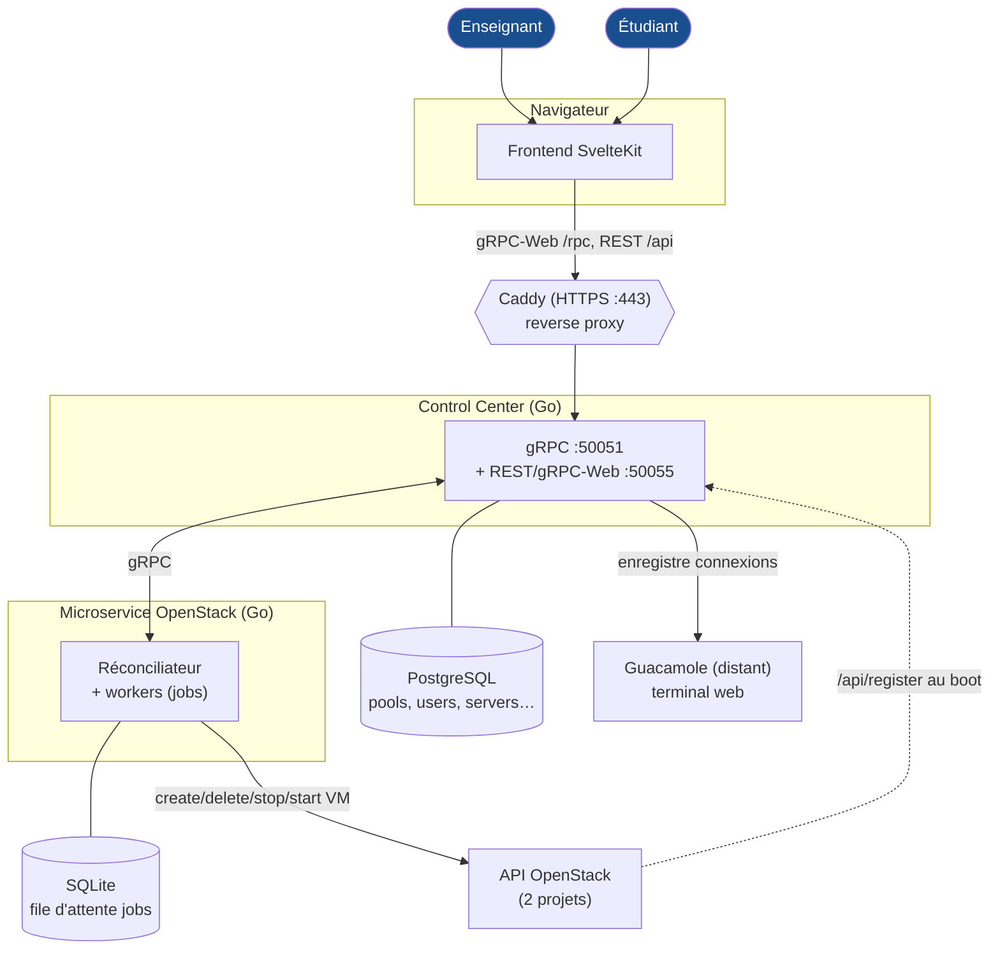

# Documentation — CloudPoolManager

Plateforme de gestion de pools de machines virtuelles pour les TP (École Polytechnique / IDCS).
Un enseignant crée des **serverpools** (groupes de VMs OpenStack) ; les étudiants s'y connectent
via GitHub et accèdent à leur VM (terminal web Guacamole, SSH, ou JupyterLab). Un module
**nbgrader** gère la distribution et la notation de devoirs Jupyter.

## Sommaire

| # | Document | Contenu |
|---|----------|---------|
| — | [Architecture générale](01-architecture.md) | Les 3 services, ports, bases de données, flux de données, les 2 projets OpenStack |
| 1 | [Authentification & connexion](02-authentification.md) | OIDC admin (Dex/GLAuth) + OAuth GitHub étudiant |
| 2 | [Création des pools](03-creation-pools.md) | Du formulaire à la VM : RPC, résolution d'image, flavors, config |
| 3 | [Provisionnement & réconciliation](04-provisionnement-reconciliation.md) | Le crawler, Min/Max VMs, scale-down, jours de fermeture |
| 4 | [Attribution aux étudiants](05-attribution-etudiants.md) | « Rejoindre un cours », `AttribVMinPool`, injection de clé SSH |
| 5 | [Accès aux VMs](06-acces-vm.md) | Guacamole (terminal web), SSH, JupyterLab |
| 6 | [Notation nbgrader](07-nbgrader-notation.md) | Créer → distribuer → collecter → noter (auto + manuel) |
| 7 | [Snapshots & images](08-snapshots-images.md) | Construction des images Jupyter/nbgrader |
| 8 | [Développement & exploitation](09-developpement-exploitation.md) | `dev.sh`, `.env`, services, dépannage |
| 9 | [Observabilité](10-observabilite.md) | Grafana + Prometheus + Loki : métriques d'usage, logs, dashboards |

## Vue d'ensemble (30 secondes)

Pour les détails de chaque flèche, voir [Architecture générale](01-architecture.md).

## Conventions de cette doc

- Les schémas sont en **Mermaid** (rendu automatique sur GitHub).
- Les références de code sont au format `chemin/fichier.go:ligne`.
- ⚠️ = piège connu / point d'attention en exploitation.
