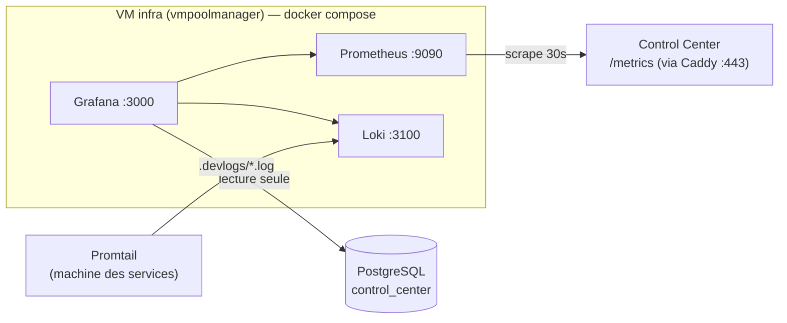

# Observabilité — Grafana + Prometheus + Loki

Stack de supervision (Grafana + Prometheus + Loki + Promtail).

> ⚠️ **Topologie selon l'environnement.** La stack doit tourner **là où elle atteint le
> Control Center (`/metrics`) et PostgreSQL**.
> - **Dev** : ces services tournent sur la machine de dev (derrière NAT/VPN, PG en `localhost`).
>   Une VM du projet `vmpoolmanager` **ne les route pas** (testé : timeout). → On déploie la
>   stack **sur la machine de dev** (`docker compose up -d`, voir « Déploiement local »).
> - **Prod** : quand le Control Center tourne sur un hôte joignable depuis `vmpoolmanager`,
>   on déploie sur une **VM infra** (voir « Déploiement sur la VM infra »).



## Ce qu'on mesure

- **Métriques** (Prometheus, depuis `/metrics` du Control Center) : `cpm_pools_total`,
  `cpm_servers{status}`, `cpm_vms_active`, `cpm_students_total`, `cpm_github_sessions_24h`,
  `cpm_pool_students{pool,owner}`. Prometheus les historise → **heures de pointe**, occupation.
- **Données métier** (datasource PostgreSQL lecture seule) : requêtes directes sur
  `vm_instances`, `serverpools`, `students`, `github_sessions`…
- **Logs** (Loki + Promtail) : logs des services (`.devlogs/*.log`).

Dashboard fourni : **CloudPoolManager — Usage** (provisionné automatiquement).

## Déploiement local (machine de dev) — recommandé pour le dev

Prérequis : Docker (Colima ou Docker Desktop) + le Control Center qui tourne (`task control`
ou `dev.sh`, donc `/metrics` sur `:50055`) + PG accessible en `localhost:5432`.

```bash
cd monitoring
cp .env.example .env        # mettre GF_ADMIN_PASSWORD ; pour le dev, CPM_PG_* = identifiants PG du .env racine
docker compose up -d        # docker-compose.override.yml (gitignoré) branche host.docker.internal
```

- Grafana : http://localhost:3000 (admin / `GF_ADMIN_PASSWORD`)
- Le fichier `docker-compose.override.yml` (non commité) : Prometheus scrape
  `host.docker.internal:50055`, Grafana atteint le PG du Mac via `host.docker.internal`,
  Promtail lit `../.devlogs/*.log` et pousse vers Loki. La config Prometheus de dev est
  `prometheus/prometheus.dev.yml`.

## Déploiement sur la VM infra (prod)

1. **Provisionner** une VM Ubuntu dans `vmpoolmanager` (réseau `public-2`), installer Docker.
2. **Créer l'utilisateur PostgreSQL lecture seule** (depuis une machine qui atteint la base) :
   ```bash
   psql "$POSTGRES_DSN" -f monitoring/grafana_ro_user.sql   # adapter le mot de passe
   ```
3. **Copier** `monitoring/` sur la VM, créer `.env` depuis `.env.example` (renseigner mots de
   passe + `CPM_PG_HOST`).
4. **Lancer** :
   ```bash
   cd monitoring && docker compose up -d
   ```
5. Accès Grafana : `http://<IP-VM-infra>:3000` (admin / `GF_ADMIN_PASSWORD`).

## Exposer `/metrics` du Control Center

Prometheus scrape `https://<control-center>/metrics`. Ajouter la route dans
`caddy/Caddyfile.native` (déjà fait dans ce dépôt) :
```
handle /metrics { reverse_proxy localhost:50055 }
```
Adapter le `target` dans `prometheus/prometheus.yml` si l'IP diffère.

## Logs (Promtail, sur la machine des services)

```bash
cd monitoring/promtail
LOKI_HOST=<IP-VM-infra> docker compose -f docker-compose.promtail.yml up -d
```

## Sécurité ⚠️

- L'utilisateur PostgreSQL est **SELECT-only** (`grafana_ro`).
- `/metrics` est exposé via Caddy : contenu = compteurs d'usage (peu sensible) ; on peut le
  protéger par un token / basic-auth ultérieurement.
- Changer `GF_ADMIN_PASSWORD`. Idéalement, mettre Grafana derrière un reverse proxy + auth.
